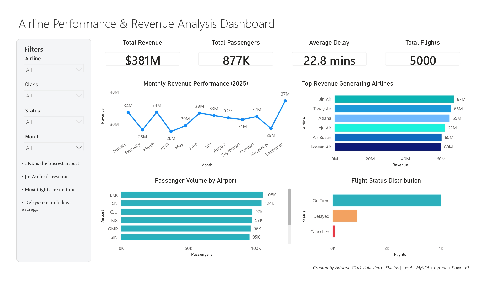

# ✈️ Airline Performance & Revenue Analysis Dashboard

## 📖 Project Overview

This project presents an end-to-end Data Analytics solution designed to analyze airline operations, passenger traffic, flight performance, and revenue generation.

Using a dataset of 5,000 flight records, I performed data analysis across multiple tools including Excel, MySQL, Python, and Power BI to identify key business insights and create an interactive executive dashboard.

The objective was to simulate a real-world airline business scenario and demonstrate practical data analytics skills that support data-driven decision-making.

---

## 🎯 Business Objectives

The analysis aims to answer the following business questions:

- Which airline generates the highest revenue?
- Which airport handles the largest passenger volume?
- How are flight delays impacting operations?
- What are the monthly revenue trends?
- What percentage of flights are on time, delayed, or cancelled?

---

## 🛠️ Tools & Technologies

| Tool | Purpose |
|--------|----------|
| Microsoft Excel | Data cleaning, formulas, Pivot Tables, Pivot Charts |
| MySQL | Data storage and business queries |
| Python (Pandas, NumPy, Matplotlib) | Data analysis and visualization |
| Power BI | Dashboard creation and KPI reporting |
| GitHub | Project documentation and portfolio showcase |

---

## 📂 Dataset Information

The dataset contains 5,000 airline flight records with the following fields:

| Column |
|----------|
| FlightID |
| FlightDate |
| Airline |
| DepartureAirport |
| ArrivalAirport |
| Class |
| Passengers |
| TicketPrice |
| DelayMinutes |
| Status |
| Revenue |

---

## 📊 Excel Analysis

### Tasks Performed

- Data validation
- Revenue calculations
- Delay categorization
- Pivot Tables
- Pivot Charts

### Excel Formulas Used

```excel
=TEXT(B2,"MMM")

=YEAR(B2)

=G2*H2
```

### Analysis Conducted

- Revenue by Airline
- Passenger Volume by Airport
- Average Delay Analysis
- Monthly Revenue Trends

---

## 🗄️ MySQL Analysis

### Database Creation

```sql
CREATE DATABASE airline_analysis;
USE airline_analysis;
```

### Key SQL Queries

#### Total Revenue

```sql
SELECT ROUND(SUM(Revenue),2) AS TotalRevenue
FROM flights;
```

#### Revenue by Airline

```sql
SELECT
Airline,
ROUND(SUM(Revenue),2) AS Revenue
FROM flights
GROUP BY Airline
ORDER BY Revenue DESC;
```

#### Passenger Volume by Airport

```sql
SELECT
DepartureAirport,
SUM(Passengers) AS TotalPassengers
FROM flights
GROUP BY DepartureAirport
ORDER BY TotalPassengers DESC;
```

#### Monthly Revenue Trend

```sql
SELECT
MONTH(FlightDate) AS MonthNo,
SUM(Revenue) AS Revenue
FROM flights
GROUP BY MonthNo
ORDER BY MonthNo;
```

---

## 🐍 Python Analysis

### Libraries Used

```python
import pandas as pd
import numpy as np
import matplotlib.pyplot as plt
```

### Analysis Performed

- Exploratory Data Analysis (EDA)
- Revenue Analysis
- Delay Analysis
- Passenger Analysis
- Correlation Analysis
- Trend Analysis

### Sample Code

```python
revenue = df.groupby("Airline")["Revenue"].sum()

print(revenue.sort_values(ascending=False))
```

---

## 📈 Power BI Dashboard

### KPIs

- Total Revenue: **381M**
- Total Passengers: **877K**
- Average Delay: **22.76 Minutes**
- Total Flights: **5,000**

### Dashboard Features

#### Monthly Revenue Trend
Tracks revenue performance throughout the year.

#### Revenue by Airline
Compares airline revenue performance.

#### Passenger Volume by Airport
Shows passenger traffic distribution across airports.

#### Flight Status Breakdown
Displays the percentage of:
- On-Time Flights
- Delayed Flights
- Cancelled Flights

#### Interactive Filters
Users can filter dashboard results by:

- Airline
- Flight Class
- Flight Status
- Month

---

## 🔍 Key Findings

### 💰 Revenue Performance

- Jin Air generated the highest total revenue among all airlines.
- Revenue remained relatively stable throughout the year with moderate monthly fluctuations.

### 🛫 Passenger Traffic

- BKK recorded the highest passenger volume among all departure airports.
- Passenger traffic was concentrated among major regional airports.

### ⏱️ Operational Performance

- More than 80% of flights operated on time.
- Average flight delay was approximately 22.76 minutes.
- Cancelled flights represented only a small portion of total operations.

### 📊 Business Insight

The airline industry relies heavily on maintaining operational efficiency and maximizing passenger volume. The analysis demonstrates that high-performing airports and airlines contribute significantly to overall revenue generation while maintaining acceptable delay levels.

---

## 🎨 Dashboard Design

### Design Principles

- Clean and minimalist layout
- Executive-style reporting
- Consistent color palette
- Focus on business storytelling
- Interactive user experience

### Color Palette

| Purpose | Color |
|----------|---------|
| Primary | #1F3A5F |
| Secondary | #4F8EF7 |
| Highlight | #2CB1BC |
| Warning | #F4A261 |
| Critical | #E63946 |

---

## 📸 Dashboard Preview

> Insert your Power BI dashboard screenshot below.



---

## 🚀 Skills Demonstrated

### Data Analytics

- Data Cleaning
- Data Validation
- Exploratory Data Analysis (EDA)
- KPI Development
- Business Insight Generation

### SQL

- Database Design
- Data Aggregation
- GROUP BY Analysis
- Business Reporting Queries

### Python

- Pandas
- NumPy
- Matplotlib
- Data Visualization

### Power BI

- Data Modeling
- DAX Measures
- Dashboard Design
- Interactive Reporting
- KPI Reporting

---

## 📁 Repository Structure

```text
Airline-Performance-Analysis/
│
├── data/
│   └── Airline_Data_5000.csv
│   └── Airline_Data_5000.xlsx
│
├── excel/
│   └── Airline_data_5000_cleaned.xlsx
│
├── powerbi/
│   ├── dash.jpg
│   └── dash.pbix
|
├── python/
│   └── airline_analysis.ipynb
│
├── sql/
│   └── queries.sql
|
├── README.md
│
└── requirements.txt
```

---

## 👤 Author

Adriane Clark Ballesteros  
Data Analyst Trainee

* 🔗 GitHub: https://github.com/acbshields12
* 🔗 Linkedin: https://www.linkedin.com/in/acsballesteros12/
* 🔗 Portfolio Website: https://acbshields12.github.io/

---


## ⭐ Project Highlights

✅ End-to-End Data Analytics Project

✅ Excel → MySQL → Python → Power BI Workflow

✅ 5,000 Flight Records Analyzed

✅ Interactive Executive Dashboard

✅ Business-Focused Insights

✅ Portfolio-Ready Project

---

If you found this project helpful, feel free to ⭐ the repository.
